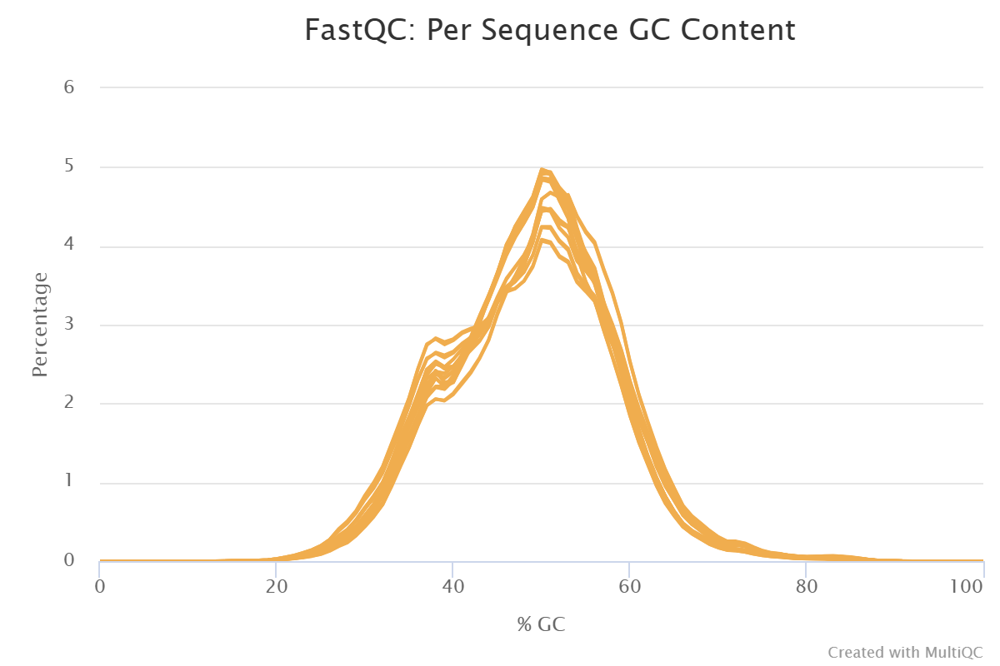
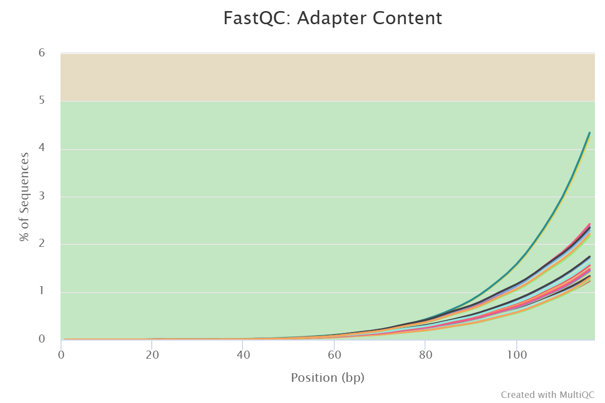
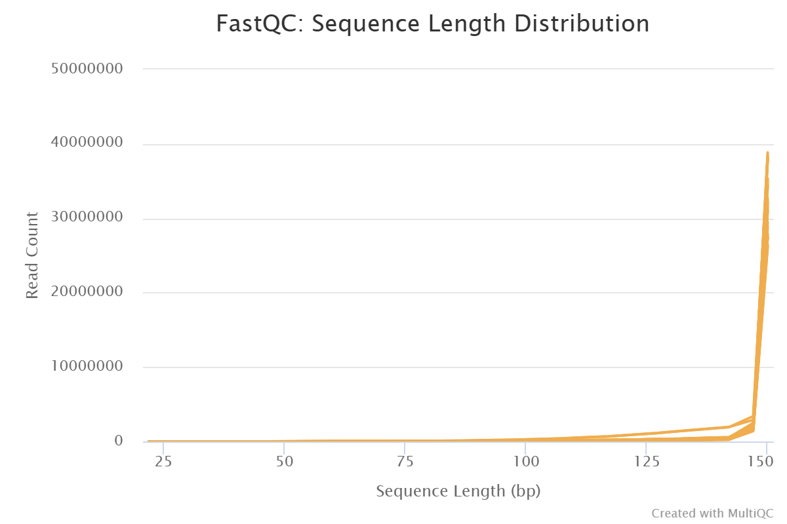
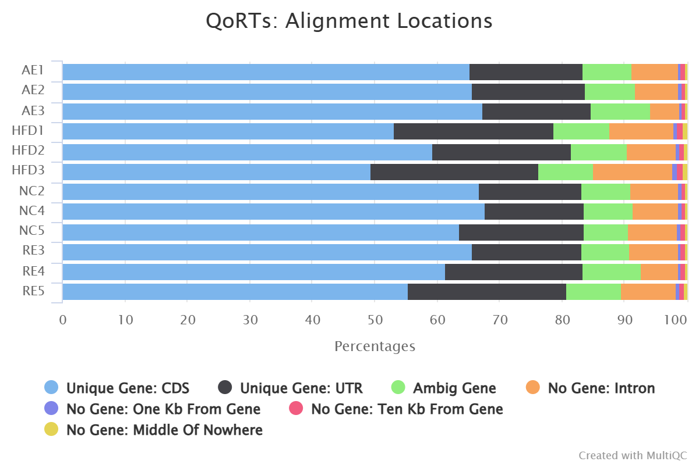

```{r setup, include=FALSE}
knitr::opts_chunk$set(echo = TRUE)
```

## Introduction
Non-Alcoholic Fatty Liver Disease (NAFLD) is a condition that is marked by the reduced ability for the liver and body to convert carbohydrates and lipids to energy, and thus an accumulation of fatty acids in the liver occurs [1]. In the case of NAFLD, this is most often the result of poor diet, increased insulin resistance, obesity, and genetic risk, and it can eventually lead to liver cirrhosis. In the United States, NAFLD is projected to affect over 47% of the population to varying degrees, a much higher prevalence than seen around the world [2]. While there are treatments undergoing studies which target insulin resistance and lipid metabolism, the current guidance to treating and managing NAFLD is adherence to a diet leading to weight loss and regular participation in exercise [3]. With the reduced cost in sequencing RNA from the body and of other organisms, questions aimed at understanding the transcriptional landscape of patients with NAFLD and the effect of exercise as a treatment on this landscape can be more accessibly explored.

In this report, the details of RNA-seq processing steps and preliminary analysis will be explained in order to begin to test the following hypothesis: **In mice with diet-induced non-alcoholic fatty liver disease, there are numerous genes that are differentially expressed compared to healthy mice with normal diets. Expression of these genes return to similar levels seen in the healthy mice after aerobic or resistance based exercise.**

## Results

After induction of NAFLD in mice, it is plausible that various biological functions are activated and suppressed according to a differential gene expression and gene set enrichment analysis. Particularly Golgi related, ATP-dependent, and odorant binding functions seem to be suppressed, while antigen binding and immunoglobulin complex functions seem to be activated. For mice that also developed NAFLD, but participated in some sort of activity, Golgi-related and odorant binding function (which were previously suppressed in NAFLD mice), were activated in comparison to the the NAFLD mice. Additionally, the mice which participated specifically in aerobic exercise experienced activation in more Golgi related functions, and suppression in immunoglobulin complex and antigen binding functions (which were previously activated in NAFLD mice) in comparison to the NAFLD mice.

Potential future experiments that would enhance this type of work would be confirmation of a reduction in NAFLD pathophysiology through tissue biopsy in mice who perform aerobic and/or resistance exercise. An additional group that performs a mix of aerobic and resistance exercise to study if both types of exercise can provide a better recovery response when combined will also be interesting.

While this dataset had a large number of reads in each sample and generally passed most QC metrics, there is uncertainty in the results due to skewness towards the 3' end in the gene body coverage. It is unclear how this might affect the analysis, but it is worrisome that this was seen in the majority of samples from 2 out of 4 conditions. This could indicate the presence of some major batch effects, that could deeply complicate the interpretation and trust of the results. Additionally, it is unclear how the samples were precisely generated and what exercise regimens were used for aerobic and resistance training. Furthermore, this dataset is limited by a small sample size (n=3) for each condition, and inclusion of more samples would ensure a more robust analysis.


## Methods

### RNA-Seq Data

The data used in this analysis was previously submitted to the NCBI Gene Expression Omnibus (GEO) on January 13, 2025 by Mingliang Wei from Wuhan University ([GSE286570](https://www.ncbi.nlm.nih.gov/geo/query/acc.cgi?acc=GSE286570)) [4]. This data captures RNA sequenced on the MGI DNBSEQ-T7 platform in a paired-end fashion from liver tissues of 6 week old male C57BL/6 mice. Mice were split into normal control (NC), high fat diet (HFD), aerobic exercise (AE), and resistance exercise (RE) conditions. Experimental procedure was as follows:

1. Mice split into normal control and high fat diet (D12492 [5]) at 6 weeks old 
2. After 8 weeks, mice on the high fat diet were split into groups where mice performed either no exercise, aerobic exercise, or resistance exercise
3. Exercise regimens continued for at least 12 weeks, after which, the RNA-seq procedure was conducted
4. Total RNA was extracted using the CWBIO RNApure Tissue & Cell Kit [6]
5. At least 2 $\mu$g of RNA was purified, and library preparation was conducted with the ABClonal Fast RNA-seq Lib Pre Kit V2 [7]
6. Samples were sequenced on a MGI DNBSEQ-T7 in paired-end fashion

Samples from 3 mice in each condition were collected, resulting in 12 total samples. Use of poly-A selection or ribo-depletion to enrich for mRNA in the sample was not directly specified in the project description, however, poly-A selection most likely occurred as explained in the Alignment section. The samples were also found to be unstranded, also as explained in the Alignment section. The project description did not specify what activities were utilized for aerobic or resistance training either. At the time of writing this analysis, a publication has not been associated with this data.

For data processing and further analysis, the European Nucleotide Archive (ENA) was accessed to download the paired-end fastq files for each of the 12 total samples ([PRJNA1209934](https://www.ebi.ac.uk/ena/browser/view/PRJNA1209934)) [8].

FastQC was used to assess the quality of the reads in the fastq file and MultiQC was used to aggregate the results from these reports [9, 10]. In general, all of the samples seemed to be adequate for continuation of analysis. Sample files had between ~29M to ~51M reads, with the mean quality score per base of these reads having a relatively high Phred Score above at least 33. This indicates that the likelihood of an incorrect base being called during sequencing to be low. While there is some slight drop off in Phred quality score near the terminal positions of the reads, a slight lowering in Phred score is expected the longer sequencing continues.

Additionally, the GC Content seems to be following a normally-distributed curve shape which no major spikes elsewhere (**Figure 1**). While there is a small increase in the percentage of of sequences with GC content around 38%, this seems to be consistent across all samples and may be reflective of the true GC content distribution in the mouse genome. If there is any true contamination, it seems to be consistent across all samples, decreasing the likelihood this will cause major effects in downstream processing.

```{r fastqc_gc_content, echo=FALSE, out.width = '75%', fig.align='center', fig.cap="**Figure 1. GC concent plot from the MultiQC (FastQC) output showing the  GC percentage for different samples. Each sample is indicated by a separate orange curve.**"}

```
\

The adapter content is also quite low, with the highest percentage of reads containing adapter sequences reaching around 4.34% near position 116 (**Figure 2**). Overall, this might not pose a large problem for alignment, however, adapter trimming was performed as described in the next section to be sure.

```{r fastqc_adapter_content, echo=FALSE, out.width = '75%', fig.align='center', fig.cap="**Figure 2. Adapter content plot from the MultiQC (FastQC) output showing the percentage of sequences per sample that match the adapter sequence at a given base pair position of the read. Each samples is indicated by a separate curve.**"}

```
\

Some samples did not pass the "per base sequence content" module. Under further inspection, it was noticed that all of the samples had very similar relative sequence content within the first 10 base pairs. This might indicate that there is some early sequencing artifacting that is specific to the MGI platform that is present in all samples (e.g. reading of the adapter sequences, bar codes, etc.). Since similar relative levels of a base at a given position is consistent across all samples, this is less likely to affect any downstream processing or analysis.

Finally, the only FastQC module which gave a "fail" for all samples was the sequence duplication levels check. However, for RNA-Seq data, this metric might not be the most important metric to rely on for data quality as it is expected that there will be varying duplication levels for various sequences throughout the library. This was also dismissed as a major cause for concern since all of the samples had very similar sequence duplication plot patterns.

Overall, the sample fastq files passed most of the FastQC measures of interest, and further processing of these files will continue with adapter trimming.


### Adapter Trimming

According to the data processing steps found in the GEO project description of the original data submission, adapter trimming was performed using Fastp [11]. To replicate this step to a similar degree, adapter trimming was performed using TrimGalore with the following adapter sequences [12]:

* **R1**: AGATCGGAAGAGCACACGTCTGAACTCCAGTCAC
* **R2**: AGATCGGAAGAGCGTCGTGTAGGGAAAGAGTGT

The stringency was set to 3 bases, which require a match of at least 3 bases with the adapter sequence before trimming so that overly-relaxed trimming of a small number of bases on each read could be prevented. The GEO project description also mentioned setting the minimum read length after trimming to 30 base pairs, however, the default of 20 base pairs was kept to allow more data to pass through this step.

Similar to the untrimmed samples, FastQC was run on each of the fastqc files and MultiQC was used to aggregate the results from these reports. Much of the results remained unchanged from before, however, the adapter content for all samples was greatly reduced. There were no samples with an adapter content greater than 0.1%. This confirms that the adapter trimming worked as expected.

Before trimming, all of the sequences in each sample file were all 150 base pairs long. Due to trimming, this is no longer the case and sequences may have different lengths due to differing matches of adapter content in TrimGalore. The sequence length distribution does not seem to have drastically shifted towards lower sequence lengths, with the majority of samples within the 140 bp to 150 bp range (**Figure 3**).

```{r trimmed_fastqc_length_distribution, echo=FALSE, out.width = '75%', fig.align='center', fig.cap="**Figure 3. Sequence length distribution plot from the MultiQC (FastQC) output that illustrate the the number of reads for sequences of a specific length for each sample. Each samples is indicated by a separate curve.**"}

```
\

Overall, these QC results of the trimmed fastq files indicate that adapter trimming occurred successfully, there were no major issues during sequencing, and the data contained in these samples seems adequate to continue further processing and analysis.


### Alignment

The GRCm39 release 36 Gencode reference genome was used for alignment, and was downloaded from the Gencode ftp server: ftp://ftp.ebi.ac.uk/pub/databases/gencode/Gencode_mouse/release_M36/. Specifically, the primary genome assembly and basic gene annotations (CHR region) were downloaded. A STAR reference index was created from these files, with a sjdbOverhang of 149 to remain consistent with the max read length of the samples of 150 bases [13].

After reference index creation, the trimmed samples were aligned to the reference using STAR, run in paired-end mode by supplying trimmed sample fastq pair files. STAR was used since it is a splice-aware aligner, and it is assumed that the reads in these files contain mRNA which has undergone splicing events. Alignments were sorted by coordinate, outputted to a BAM file, and indexed with STAR.

The lowest uniquely mapped read percentage after alignment across all samples was 87.19%, so in general, most of the reads in all of the samples were mapped to a single location which also leads to a large retention in the reads from the sample for future analysis. In all cases, less than 10% of the reads were multi-mapping, so there is only a small portion of such reads (other unmapped reads also comprise a very small percentage) which will not be utilized for featureCounts and further analysis.

QORTS was run to assess key attributes of the alignment [14]. Specifically, the distribution of locations of mapped reads and gene body coverage are of interest. The distribution of mapped read locations indicates what type of gene or non-gene the read is aligned to. It is observed that most of the mapped reads are assigned to gene regions, while any of the non-gene regions are contained to less than 15% at most (**Figure 4**). Primarily, this is an indication that mRNA was successfully enriched for during the library preparation. According to this data, it is likely that poly-A selection occurred since there is a much greater proportion of gene regions (exons) compared to intronic regions. If ribo-depletion was used, it would be expected that there would be a much higher proportion of reads assigned to intronic regions. Additionally, this indicates that there will be enough data to potentially conduct a meaningful differential gene expression analysis further along.

```{r qorts_alignment_distribution, echo=FALSE, out.width = '75%', fig.align='center', fig.cap="**Figure 4. Alignment locations percentage from MultiQC (QORTS) showing the distribution of types of gene and non-gene locations that reads were mapped to from STAR.**"}

```
\

When considering the QORTS strandedness module, the first strand and second strand proportions are very similar to each other (varying between ~36% to ~44%). This indicates that the library preparation was most likely not conduced in a stranded fashion.

Additionally, gene body coverage shows relatively uniform coverage across the gene body, with no major skews in the distribution for the NC and AE conditions, indicating that it is unlikely that any RNA degradation or other technical problems during sequencing occurred (**Figure 5**). However, the HFD and RE conditions both have most (if not all) of the samples with a 3' bias in the gene body coverage plots. This indicates that there may be some issues with RNA degradation or technical sequencing problems. This result is quite concerning as any results from counting reads and the differential gene expression analysis might be affected for this conditions. For example, if there a significant differentially expression genes in the HFD condition compared to the NC condition, it is unclear whether that effect is due to some technical effects explained by the skew in the gene body coverage or a true biological effect. Similarly, if genes are more similarly expressed between NC and AE conditions compared to HFD conditions, this might be a technical artifact of this skew rather than a biological effect. To try to alleviate this problem to a small degree during read counting, read pairs will be counted so that both reads must cover the gene for a count to occur, and read counts will be summarized at the gene-level instead of the exon level, since the exon-level might be much more unreliable with uneven gene body coverage.

```{r plot_gene_body_coverage_qorts, message=FALSE, warning=FALSE, fig.align='center', fig.cap="**Figure 5. Total gene body coverage from QORTS showing the percentage of reads that are mapped to regions which cover various percentiles of the gene body**"}
library(tidyverse)

# Load in all the gene body coverage data from the QORTS reports
gene_body_coverage <- NULL
for (sample_name in c("AE1", "AE2", "AE3", "HFD1", "HFD2", "HFD3", "NC2", "NC4", "NC5", "RE3", "RE4", "RE5")) {
  gene_body_coverage <- rbind(
    gene_body_coverage, 
    as.data.frame(read.table(gzfile(paste0("../qc/qorts/", sample_name, "/QC.geneBodyCoverage.byExpr.avgPct.txt.gz")), header=TRUE)) %>% 
      mutate(sample = sample_name, condition = gsub("[0-9]", "", sample_name))
    )
}

# Plot gene body coverage, split by condition
ggplot(gene_body_coverage, aes(x=QUANTILE, y=TOTAL, color=sample)) +
  facet_wrap(vars(condition)) +
  geom_line() + 
  labs(x="Quantile (5' -> 3')", y="Percentage of reads", title="Total Gene Body Coverage")
```


### Gene-level Counts

Gene-level read counts were calculated using the featureCounts software in paired-end mode and ensuring to count for read pairs rather than total reads [15]. Data output from featureCounts were summarized on the meta-feature level (gene-level). Once again, this was done to allow for easier analysis and interpretability of the results (exon-level summarization may be more difficult to interpret on a broader biological function level) and to attempt to alleviate any technical effects seen in the 3' biased gene-body coverage plots.

To assess the read count assignment, the counts were read into R, and a DESeq2 object generation script was run [156]. This script creates the DESeq2 object, removes genes without reads (37407 genes removed), and normalizes the read counts with DESeq size factors. These normalized counts are passed through a log function as well as a rlog function to account for any mean-variance read count dependence effects, especially exemplified with lower read counts. Analysis of the effect of normalization and rlog application are explored in the "read_counts_exploration.Rmd" report, and both normalization and rlog transformations seem to have successfully normalizing the data with size factors and stabilizing variance, respectively.

```{r deseq2_object_preparation, message=FALSE, warning=FALSE}
# Import necessary libraries
library(DESeq2)

# Load the read counts (gene-level) from the featureCounts output
# and clean the sample names
read_counts_df <- read.table("../featureCounts/read_counts_gene", header=TRUE)
names(read_counts_df) <- gsub(".*(NC|HFD|AE|RE)([0-9]).*", "\\1\\2", names(read_counts_df))

# Create countData dataframe that will be passed into DESeq2 object
# The format is genes (rows) by samples (columns) with the values being the counts
# determined from featureCounts
row.names(read_counts_df) <- make.names(gsub("[.].*", "", read_counts_df$Geneid))
nafld_countData_df <- read_counts_df[ , -c(1:6)]

# Create colData dataframe that maps the samples to the condition
nafld_colData_df <- data.frame(condition = gsub("[0-9]", "", names(nafld_countData_df)),
                               row.names = colnames(nafld_countData_df))

# Create a rowData dataframe that stores all additional information about 
# each gene in the countData dataframe
nafld_rowData_df <- read_counts_df[, 1:6]


# Create DESeq2 Object from these three dataframes above
nafld_dds <- DESeqDataSetFromMatrix(countData=nafld_countData_df,
                                    colData=nafld_colData_df,
                                    rowData=nafld_rowData_df,
                                    design=~condition)

# Remove genes that do not have any reads
genes_with_reads <- rowSums(counts(nafld_dds)) > 0
nafld_dds <- nafld_dds[genes_with_reads, ]

# Normalize read counts using DESeq2 Size Factors
nafld_dds <- estimateSizeFactors(nafld_dds)

# Log the normalized counts
assay(nafld_dds, "log_norm_counts") <- log2(counts(nafld_dds, normalized=TRUE) + 1)

# Use rlog to attempt to reduce the effect of any variance-mean dependence of 
# read counts
nafld_rlog <- rlog(nafld_dds, blind = TRUE)
```
\

A heatmap of the rlog log-normalized data is then generated by first calculating 1 - pearson correlation coefficient on a pairwise basis for each sample (**Figure 6**). A dendrogram clustering these samples is also generated. The NC (negative control) and HFD (positive control) are clustered among themselves as expected. However, the AE and RE (exercise conditions) are less distinctly clustered. 2 of the AE samples are closer in correlation to the NC samples, while 2 of the RE samples are closer to the HFD samples. Differences in these could be attributed to the technical effects that were seen in the skewed gene body coverage, however, it is difficult to extract biological meaning directly. At a glance, it is expected that at least the positive and negative controls have lower correlation with each other but high correlation with their own samples.

```{r sample_correlation_heatmap, message=FALSE, warning=FALSE, fig.align='center', fig.cap="**Figure 6. Heatmap of the pairwise (1 - pearson correlation coefficient) for the rlog log-nromalized read count values for all of the samples. A dendrogram, generated from complete hierarchical clustering, is present on top**"}
library(pheatmap)

# Calculate the pairwise pearson correlation coefficient for the samples
corr_coeff <- cor(assay(nafld_rlog), method="pearson")

# Plot 1 - correlation coefficient on the heatmap
as.matrix(as.dist(1-corr_coeff)) %>%
  pheatmap(main="1 - Pearson Correlation Coefficient", treeheight_row=0)
```

Principal Component Analysis (PCA) of the rlog log-normalized read counts was also conducted and a few 2D dot plots of various combinations of the first 3 principal components were visualization (**Figure 7**). PC1 and PC3 are all able to separate NC and HFD samples from each other. PC1 and PC2 seem to be able to separate AE from NC and HFD samples as well, although there are very tight margins for separation. It is difficult to separate RE from any of the other conditions with these 3 PCs. RE might not be able to be well separated from the other conditions due to a very mild or inconsistent effect that resistance exercise has on HFD, but this cannot be definitively confirmed from this plot. In general, it seems that different conditions can be separated from one another relatively well, indicating some difference in the transcriptional landscape.


```{r sample_pca, fig.align='center', fig.cap="**Figure 7. Principal component plots from a principal component analysis of the samples in the rlog log-normalized read count space. The top left plot shows the samples in the PC1-PC2 space, the top right shows the samples in the PC1-PC3 space, and the bottom left plot shoes the samples in the PC2-PC3 space**"}

# Calculate PCA for the rlog log-norm data
# Retain the conditions by removing the numbers at the end of the sample name
pca_results <- as.data.frame(prcomp(t(assay(nafld_rlog)))$x)
pca_results$sample = rownames(pca_results)
pca_results$condition = gsub("[0-9]", "", pca_results$sample)

# PC1 vs PC2 plot
PC1_v_PC2 <- ggplot(pca_results, aes(x=PC1, y=PC2, color=condition)) + 
  geom_point(size=3)

# PC1 vs PC3 plot
PC1_v_PC3 <- ggplot(pca_results, aes(x=PC1, y=PC3, color=condition)) + 
  geom_point(size=3)

# PC2 vs PC3 plot
PC2_v_PC3 <- ggplot(pca_results, aes(x=PC2, y=PC3, color=condition)) + 
  geom_point(size=3)

# Combine the PCA plots onto a grid
cowplot::plot_grid(PC1_v_PC2, PC1_v_PC3, PC2_v_PC3, ncol=2)
```
\

After relatively expected results from exploring the read counts data, differential gene expression (DGE) analysis and gene set enrichment analysis (GSEA) can be conducted.


### DGE and GSEA

To perform the differential gene expression analysis (DGE), the same DESeq2 object generation script was sourced in the "DGE_GSEA.Rmd" notebook for performing all next steps. After creation of the DESeq2 object, the condition factors were re-leveled to a reference condition of NC. This will facilitate the first comparison of finding differentially expressed genes in the HFD condition with respect to NC. The DESeq() function was called to perform the DGE and independent filtering with an FDR of $\alpha$ = 0.05 was performed. Plots exploring the distribution of adjusted p-values and a heatmap of significant ($\alpha$ < 0.05) differentially expressed genes row-based z-score were generated. Additionally, before generating the volcano plot, log-fold change shrinkage was performed using the apeglm algorithm [17].


```{r relevel_condition_and_shrink_lfc, warning=FALSE, message=FALSE}
# Re-level conditions with reference to NC
nafld_dds$condition <- nafld_dds$condition %>% relevel(ref="NC")

# Run DESeq DGE
nafld_dds <- nafld_dds %>% DESeq()

# Independent filtering with alpha = 0.05
HFD_vs_NC_results <- results(nafld_dds, name="condition_HFD_vs_NC", independentFiltering = TRUE, alpha = 0.05)

# Shrink the log 2 fold change values using apeglm
HFD_vs_NC_results_shrunk <- lfcShrink(nafld_dds,
                               coef="condition_HFD_vs_NC", 
                               type="apeglm")
```
\

Using the log fold change shrunk values, a volcano plot (Figure 8) was generated to view the differentially expressed genes that passed a log fold change cutoff of 1 and significance threshold ($\alpha$ < 0.05).

```{r volcano_plot, warning=FALSE, message=FALSE, fig.align='center', fig.height=8, fig.cap="**Figure 8. Volcano plot showing significant differentially expressed genes (in red) that have a log fold change greater than 1 and fall within the p-value threshold of 0.05. This plot was generated from the differential gene expression analysis of HFD vs NC and applying log fold change shrinkage**"}
library(EnhancedVolcano)

# Volcano plot using the LFC shrunk values
EnhancedVolcano(HFD_vs_NC_results_shrunk, lab=rownames(HFD_vs_NC_results_shrunk), 
                       x='log2FoldChange', y='padj', pCutoff = 0.05, title="HFD vs NC")
```

While this provides insight into the specific genes which were differentially expressed, a higher level understanding of how specific biological functions comprised of gene sets are activated or suppressed. Thus, GSEA was performed on the HFD vs NC log fold changes. To do so, a list of all genes found in this comparison were sorted in decreasing order by the log fold change value and passed to the gseGO() function matching on the ENSEMBL key. The benjamini-hochberg multiple testing correction was utilized and a p-value cutoff of $\alpha$ < 0.05 was used. The top 10 gene sets ranked by adjusted p value were outputted for both the activated and suppressed gene sets (only 3 were significantly activated) (Figure 9).

```{r gsea_HFD_vs_NC, warning=FALSE, message=FALSE, fig.height=8, fig.cap="**Figure 9. Dot plot showing the resulst of the gene set enrichment analysis, where the top 10 (if present) gene sets, ordered by adjusted p-value, for activation/suppression changes are shown. The size of the dot indicates the count of genes enriched for in the gene set, and the color indicates the adjusted p-value**"}
library(clusterProfiler)
library(enrichplot)
library(org.Mm.eg.db)

# Rank the genes from the DGE by log fold change in decreasing order
gene_list <- HFD_vs_NC_results$log2FoldChange
names(gene_list) <- rownames(HFD_vs_NC_results)
gene_list <- sort(gene_list, decreasing = TRUE)

# Perform GSEA
gse <- gseGO(geneList=gene_list,
             ont ="ALL",
             keyType = "ENSEMBL",
             minGSSize = 3,
             maxGSSize = 800,
             pvalueCutoff = 0.05,
             verbose = TRUE,
             OrgDb = "org.Mm.eg.db",
             pAdjustMethod = "BH")

# Generate dot plot of the top 10 gene sets ranked by adjusted p-value
dotplot(gse, showCategory=10, split=".sign") + facet_grid(.~.sign)
```
\

To address the second part of the hypothesis, a DGE and GSEA are also computed for the AE and RE conditions, but this time, with respect to the HFD condition. This is done to understand how much the AE and RE conditions differ from the HFD condition and whether some of the induced effects seen in the HFD condition from the NC condition are "reverted". A similar approach was taken for these additional GSEA procedures, and a bar plot comparing the enrichment scores of the original 13 gene sets across the 3 GSEA comparisons was generated (Figure 10).

```{r AE_and_RE_vs_HFD_GSEA, warning=FALSE, message=FALSE, fig.height=9, fig.align='center', fig.cap="**Figure 10. Bar plot showing the GSEA enrichment scores for the gene sets identified previously for AE vs HFD (left), HFD vs NC (middle), and RE vs HFD (right). Red bar plots indicate a suppression change and green bar plots indicate an activation change**"}

# Re-level the DESeq object with reference to HFD and perform DGE
nafld_dds$condition <- nafld_dds$condition %>% relevel(ref="HFD")
hfd_ref_dds <- nafld_dds %>% DESeq()

# Independent filtering of the DGE results with alpha = 0.05
AE_vs_HFD_results <- results(hfd_ref_dds, name="condition_AE_vs_HFD", independentFiltering = TRUE, alpha = 0.05)
RE_vs_HFD_results <- results(hfd_ref_dds, name="condition_RE_vs_HFD", independentFiltering = TRUE, alpha = 0.05)

# Rank the gene lists from the DGE by decreasing log fold change
gene_list_AE <- AE_vs_HFD_results$log2FoldChange
names(gene_list_AE) <- rownames(AE_vs_HFD_results)
gene_list_AE <- sort(gene_list_AE, decreasing = TRUE)

gene_list_RE <- RE_vs_HFD_results$log2FoldChange
names(gene_list_RE) <- rownames(RE_vs_HFD_results)
gene_list_RE <- sort(gene_list_RE, decreasing = TRUE)

# Perform GSEA of AE vs HFD and RE vs HFD
gse_AE_vs_HFD <- gseGO(geneList=gene_list_AE,
                       ont ="ALL",
                       keyType = "ENSEMBL",
                       minGSSize = 3,
                       maxGSSize = 800,
                       pvalueCutoff = 0.05,
                       verbose = TRUE,
                       OrgDb = "org.Mm.eg.db",
                       pAdjustMethod = "BH")

gse_RE_vs_HFD <- gseGO(geneList=gene_list_RE,
                       ont ="ALL",
                       keyType = "ENSEMBL",
                       minGSSize = 3,
                       maxGSSize = 800,
                       pvalueCutoff = 0.05,
                       verbose = TRUE,
                       OrgDb = "org.Mm.eg.db",
                       pAdjustMethod = "BH")

# Get top GO terms ranked by adjusted p value in activated and suppressed categories
top_GO <- c(gse@result %>% filter(enrichmentScore > 0) %>% slice_min(p.adjust, n=10, with_ties = FALSE) %>% pull(ID), 
            gse@result %>% filter(enrichmentScore < 0) %>% slice_min(p.adjust, n=10, with_ties = FALSE) %>% pull(ID))

# Filter GSEA results by the top GO terms above and select Description and Enrichment Score for all comparisons
desc_ES_HFD_vs_NC <- gse@result %>% filter(ID %in% top_GO) %>% dplyr::select(Description, enrichmentScore)
desc_ES_AE_vs_HFD <- gse_AE_vs_HFD@result %>% filter(ID %in% top_GO) %>% dplyr::select(Description, enrichmentScore)
desc_ES_RE_vs_HFD <- gse_RE_vs_HFD@result %>% filter(ID %in% top_GO) %>% dplyr::select(Description, enrichmentScore)

# Combine filtered dataframes from above and add condition and sign fields
total_enrichment_scores <- bind_rows(desc_ES_HFD_vs_NC %>% mutate(condition="HFD"),
                                     desc_ES_AE_vs_HFD %>% mutate(condition="AE"),
                                     desc_ES_RE_vs_HFD %>% mutate(condition="RE")) %>%
  mutate(sign=if_else(enrichmentScore < 0, "Suppressed", "Activated"))

# Bar plot to show enrichment score for various conditions
ggplot(total_enrichment_scores, aes(x=enrichmentScore, y=Description, fill=sign)) + 
  geom_bar(stat="identity", position = position_dodge(preserve="single")) + 
  scale_y_discrete(labels = function(x) str_wrap(x, width = 12)) + 
  scale_fill_manual(values=c("palegreen3", "indianred3")) +
  geom_vline(xintercept = 0, linetype="dashed") + 
  facet_wrap(vars(condition))

```

## Discussion

As explained in the Results and Methods section, the data description was unclear about which mRNA enrichment method was used during library preparation and the strandedness of the data. This was overcome by using the QORTS alignment location and strandedness modules. There was a large amount of assigned exonic regions compared to low intronic regions, which indicated that poly-A selection most likely occurred. Additionally, the strandedness test showed large proportions of both the forward and reverse strand.

Additionally, there is a possibility of technical/batch effects, as seen in the fact that the majority of the HFD and RE samples have a 3' gene body coverage skew, but this is not seen in the NC and AE conditions. If this measure indicates presence of batch effects in the data, this could explain why the RE condition had much less enriched gene sets that exhibited an expression change from the HFD group compared to the AE group. While this may or may not be the reason, it becomes difficult to identify what is a technical effect or a true biological effect in the analysis. This was attempted to have been alleviated by summarizing the read counts on the gene level rather than the exon level, but this would only alleviate direct effects of a skewed gene body coverage plot. If these batch effects caused technical differences in some other aspects of the data, this would not have been accounted for. In future analysis, batch effect correction methods can be experimented with.

The following data was generated to allow for ease in generating the plots and analyses mentioned in this report without running the bash scripts.


| File Location                     | Description                                                                                                                                                                    |
|-----------------------------------|--------------------------------------------------------------------------------------------------------------------------------------------------------------------------------|
| data/deseq2_object_workspace.RData | Contains all of the R workspace variables after running the process_DESeq2_object.R script. This can be used in lieu of the script if the featureCounts data is not available.  |
| data/HFD_vs_NC_DGE.csv            | Contains the ENSEMBL gene id, log 2 fold change, p-value, and adjusted p-value for the HFD vs NC DGE.                                                                          |
| data/AE_vs_HFD_DGE.csv            | Contains the ENSEMBL gene id, log 2 fold change, p-value, and adjusted p-value for the AE vs HFD DGE.                                                                          |
| data/RE_vs_HFD_DGE.csv            | Contains the ENSEMBL gene id, log 2 fold change, p-value, and adjusted p-value for the RE vs HFD DGE.                                                                          |

## Code and Data Availability

The code used to run these processing and analysis steps can be found on GitHub at https://github.com/sohomsd/nafld-exercise-dge.

Plots from MultiQC can be downloaded from the html report files that are also published at the GitHub repository. These were exported directly from the reports and uploaded to the report.

For all other plots in this report, code is provided in the scripts and reports directories in the GitHub repository. The code use to generate the figures (other than the MultiQC plots) can be found by "un-hiding" the code blocks above the figures.

## References
[1] Loomba R, Friedman SL, Shulman GI. Mechanisms and disease consequences of nonalcoholic fatty liver disease. Cell. 2021 May 13;184(10):2537-2564. doi: 10.1016/j.cell.2021.04.015. PMID: 33989548.

[2] Teng ML, Ng CH, Huang DQ, Chan KE, Tan DJ, Lim WH, Yang JD, Tan E, Muthiah MD. Global incidence and prevalence of nonalcoholic fatty liver disease. Clin Mol Hepatol. 2023 Feb;29(Suppl):S32-S42. doi: 10.3350/cmh.2022.0365. Epub 2022 Dec 14. PMID: 36517002; PMCID: PMC10029957.

[3] Shen K, Singh AD, Modaresi Esfeh J, Wakim-Fleming J. Therapies for non-alcoholic fatty liver disease: A 2022 update. World J Hepatol. 2022 Sep 27;14(9):1718-1729. doi: 10.4254/wjh.v14.i9.1718. PMID: 36185717; PMCID: PMC9521452.

[4] https://www.ncbi.nlm.nih.gov/geo/query/acc.cgi?acc=GSE286570

[5] https://researchdiets.com/formulas/d12492

[6] https://www.cwbiosciences.com/goods/index/id/58

[7] https://eutemp.abclonal.com/catalog-antibodies/FastRNAseqLibPrepKitV2/RK20306

[8] https://www.ebi.ac.uk/ena/browser/view/PRJNA1209934

[9] Andrews S. (2010). FastQC: a quality control tool for high throughput sequence data. Available online at: http://www.bioinformatics.babraham.ac.uk/projects/fastqc

[10] Philip Ewels, Måns Magnusson, Sverker Lundin, Max Käller, MultiQC: summarize analysis results for multiple tools and samples in a single report, Bioinformatics, Volume 32, Issue 19, October 2016, Pages 3047–3048, https://doi.org/10.1093/bioinformatics/btw354

[11] Shifu Chen, Yanqing Zhou, Yaru Chen, Jia Gu; fastp: an ultra-fast all-in-one FASTQ preprocessor, Bioinformatics, Volume 34, Issue 17, 1 September 2018, Pages i884–i890, https://doi.org/10.1093/bioinformatics/bty560

[12] Felix Krueger, Frankie James, Phil Ewels, Ebrahim Afyounian, Michael Weinstein, Benjamin Schuster-Boeckler, Gert Hulselmans, & sclamons. (2023). FelixKrueger/TrimGalore: v0.6.10 - add default decompression path (0.6.10). Zenodo. https://doi.org/10.5281/zenodo.7598955

[13] Dobin A, Davis CA, Schlesinger F, Drenkow J, Zaleski C, Jha S, Batut P, Chaisson M, Gingeras TR. STAR: ultrafast universal RNA-seq aligner. Bioinformatics. 2013 Jan 1;29(1):15-21. doi: 10.1093/bioinformatics/bts635. Epub 2012 Oct 25. PMID: 23104886; PMCID: PMC3530905.

[14] Hartley SW, Mullikin JC. QoRTs: a comprehensive toolset for quality control and data processing of RNA-Seq experiments. BMC Bioinformatics. doi: 10.1186/s12859-015-0670-5

[15] Liao Y, Smyth GK and Shi W (2014). featureCounts: an efficient general purpose program for assigning sequence reads to genomic features. Bioinformatics, 30(7):923-30.

[16] Love, M.I., Huber, W., Anders, S. Moderated estimation of fold change and dispersion for RNA-seq data with DESeq2 Genome Biology
  15(12):550 (2014)
  
[17] Zhu, A., Ibrahim, J.G., Love, M.I. (2018) Heavy-tailed prior distributions for
    sequence count data: removing the noise and preserving large differences.
    Bioinformatics. https://doi.org/10.1093/bioinformatics/bty895